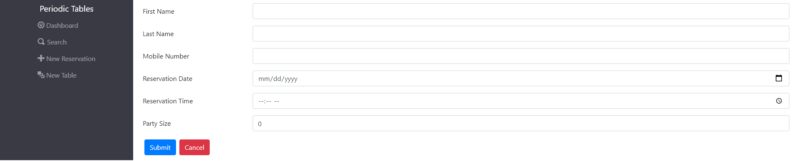

# Restaurant Reservation System

The software is used only by personnel at a fine dining restaurant when a customer calls to request a reservation.

 ## Links
 - [Deployment](https://restaurant-reservations-sigma.vercel.app/) 
 
 ## Project Screenshots
 
### Dashboard:

Tables will have a 'finish' button once they are occupied so they can be cleared for the next guests.

### Create a new reservation:

Reservations will be made on this page. Data field verification on the front and back end to prevent creation of an incomplete reservation.
### Create a new table:
 
New tables can be add here.
### Search for customer by phone number:

Search for reservations by phone number.
 
 ## Technology
 ### Built with:
 - ReactJS   
 - Node.js
 - PostgreSQL
 - Bootstrap
 - Knex.js 
 - Express.js 
 - CORS

